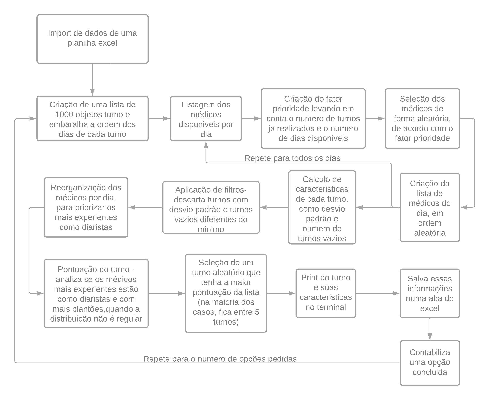

# Criador de escala de médicos

## Marcelo Lopes Valerio - email: mar.valerio@hotmail.com.br

## Projeto pessoal - pedido especial de um familiar

### Tendo os médicos, seus dias disponíveis, e a quantidade de medicos necessaria por dia, gera a escala da semana/mês, priorizando a/as opções com menor desvio padrão dentre um numero pre estabelecido de iterações, levando em conta também se todos os plantões estão preenchidos

## Regras de negócio:

### - Um médico não pode fazer plantões de 36 horas (dia-noite-dia consecutivos, por exemplo).
### - Idealmente, o melhor turno é aquele no qual o numero de turnos de todos os médicos é igual.
### - Se não for possível preencher todas as vagas de plantão, o melhor plantão deve obrigatóriamente conter o maior numero possível de vagas ocupadas, mesmo que isso deixe a distribuição desigual.
### - Deve ter a opção de escolher entre turnos diários e noturnos, ou apenas diários.
### - A usabilidade do software deve ser simples, podendo rodar em qualquer máquina, com o mínimo de programas auxiliares possiveis, entretanto, preferencialmente utilizando excel.
### - O plantão do tipo diarista é mais valorizado, e deve ficar com os médicos mais experientes, ou com os médicos que o usuário escolher priorizar
### - O melhor plantão é aquele que, quando não for possível distribuir todos os turnos igualmente, dá os turnos remanescentes aos médicos mais experientes, e os mesmos são diaristas mais vezes

## Para rodar o código:

### Para rodar o código, há duas opções; a primeira é colocar o arquivo do excel como o do exemplo dado preenchido dentro da pasta do código (pode ser no mesmo nível que a pasta src), ou é possível pegar apenas o arquivo .exe (dentro de dist), e rodá-lo numa pasta com a planilha excel preenchida (nos dois casos, necessariamente a planilha deve chamar "escala_plantao.xlsx").

### Simples assim, surgirá um novo arquivo excel na pasta, chamado Turnos.xlsx, que terá uma opção de turno em cada aba, de acordo com o número de opções solicitado. Além disso, o resultado aparecerá no terminal.

### Instruções de preenchimento da planilha na primeira aba da mesma - é recomendado manter o arquivo original como exemplo e utilizar cópias do mesmo.

## Funcionamento do código - encadeamento de funções

    

### Para mais detalhes sobre as funções/métodos, leia as docstrings dos mesmos.

## Arquivo Excel - Apêndice
### No arquivo excel, há uma documentação sobre o uso do mesmo, e botões para melhor navegação